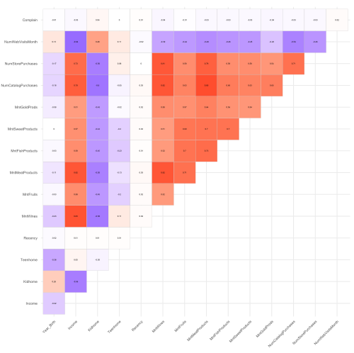
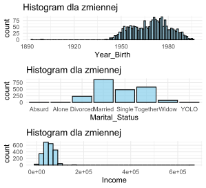

# Eksploracyjna Analiza Danych

Raport z *Eksploracyjnej Analizy Danych (EDA)*, który pozwoli na zrozumienie głównych cech zbioru danych. Obejmuje on wizualizację danych, identyfikację wzorców oraz zrozumienie struktury i relacji między zmiennymi. EDA jest kluczowym krokiem w procesie analizy danych, który pomaga w wydobyciu istotnych informacji i spostrzeżeń z danych, a wyniki EDA powinny służyć jako podstawa do dalszej transformacji danych i modelowania.

## Spis treści

1. Przedstawienie zbioru danych
2. Wizualizacja rozkładów
3. Zależności pomiędzy zmiennymi
4. Obserwacje nietypowe

## 1. Przedstawienie zbioru danych

Poznanie zmiennych jest pierwszym i najważniejszym etapem w *Eksploracyjnej Analizie Danych*. Znajomość struktury zbioru i zrozumienie tego, co przedstawiają poszczególne wartości jest kluczowym elementem do przeprowadzenia sktucznej analizy i modelowania.

### Zmienne

`AcceptedCmp{1-5}`*[bool]* -  czy klient zaakceptował ofertę *{1,2,3,4,5}* kampanii.

`Response`*[bool]* - czy klient zaakceptował ofertę ostatniej kampanii.

`Complain`*[bool]* - czy klient składał skargę w przeciągu dwóch ostanich lat.

`DtCustomer`*[Date]* - data założenia konta.

`Education`*[char]* - poziom edukacji klienta.

`Marital`*[char]* - stan cywilny klienta.

`Kidhome`*[int]* - liczba małych dzieci zamieszkałcyh z klientem.

`Teenhome`*[int]* - liczba nastolatków zaamieszkałych z klientem.

`Income`*[int]* - roczny dochód gospodarstwa klienta.

`MntFishProducts`*[int]* - wydatki na produkty rybne w przeciągu ostatnich dwóch lat.

`MntMeatProducts`*[int]* - wydatki na produkty mięsne w przeciągu ostatnich dwóch lat.

`MntFruits`*[int]* - wydatki na owoce w przeciągu ostatnich dwóch lat.

`MntSweetProducts`*[int]* - wydatki na słodycze w przeciągu ostatnich dwóch lat.

`MntWines`*[int]* - wydatki na wino w przeciągu ostatnich dwóch lat.

`MntGoldProds`*[int]* - wydatki na wyroby ze złota w przeciągu ostatnich dwóch lat.

`NumDelasPurchases`*[int]* - liczba zakupów ze zniżką.

`NumCatalogPurchases`*[int]* - liczba zakupów z wykorzystaniem katalogu.

`NumStorePurchases`*[int]* - liczba zakupów wykonanych bezpośrednio w sklepie. 

`NumWebPurchases`*[int]* - liczba zakupów dokonoanych przez stronę internetową. 

`NumWebVisitsMonth`*[int]* - liczba wizyt na stronie internetowej w przeciągu ostatniego miesiąca.

`Recency`*[int]* - liczba dni od ostaniego zakupu.

## 2. Wizualizacja rozkładów 

Wizualizacja rozkładów wartości zmiennych pozwala na szybkie i intuicyjne zrozumienie struktury danych. Umożliwia identyfikację trendów, anomalii i wzorców występująych w danych, które mogą nie być oczywiste.

## 3. Zależności pomiędzy zmiennymi

Poznanie korelacji pomiędzy zmiennymi pozwala na zrozumienie, jak są one ze sobą powiązane. Jeśli dwie z nich są silnie skorelowane, zmiana jednej może przewidywalnie wpływać na drugą. Zrozumienie tego jest kluczowe w identyfikacji zależności przyczynowo-skutkowych między zmiennymi oraz jest niezbędne do budowy efektywnych modeli predykcyjnych.

### Korelacje pomiędzy zmiennymi nuemrycznymi

Z wykresu wynika, że zmienne `Complain` i `Recency` nie wykazują korelacji z innymi zmiennymi numerycznymi.

`Income` wykazuje wysoką korelację (powyżej *0.5*) z wieloma zmiennymi, w szczególności z `MntWines`, `MntMeatProducts`, `NumCatalogPurchases` i `NumStorePurchases`, z którymi współczynnik korelacji Spearmana wyniósł powyżej *0.7*.

Warto zwrócić uwagę na zmienne odnoszące się do liczby kupowanych towarów oraz `NumWebVisitsMonth`, które są silnie skorelowane między sobą, a także ze zmiennymi `Income` oraz `Kidhome`.

## 4. Obserwacje nietypowe

Detekcja nietypowych obserwacji pozwala na zidentyfikowanie nieporządanych w zbiorze wartości, które mogą wynikać np. z błędu człowieka lub defektu maszyny. Odpowienia strategia ich rozpoznawania i obsługi jest niezbędna do zbudowania skutecznego modelu predykcyjnego.

Eksploracja zbioru skutkowała znalezieniem nietypowych obserwacji. W zmiennej `Year_Birth` znalezione zostały obserwacji znacznie odstające od reszty, które najprawdopodobniej wynikały z błędu człowieka, jako strategię obsługi tych obserwacji wybrano zastopienie ich medianą.

Dla zmiennej `Martial_Status` występowały małoliczne klasy, które wynikały ze słabo przygotowanego stystemu kontrolującego wprowadzane przez użytkowników dane, jako strategię radzenia sobie z takimi obserwacjami przyjęto zastąpienie ich modą.

Zmienna `Income` posiadała obserwacje z obserwacjami odstającymi, przyjęta strategia pokrywała się z tą zastosowaną przy zmiennej `Year_Birth`.