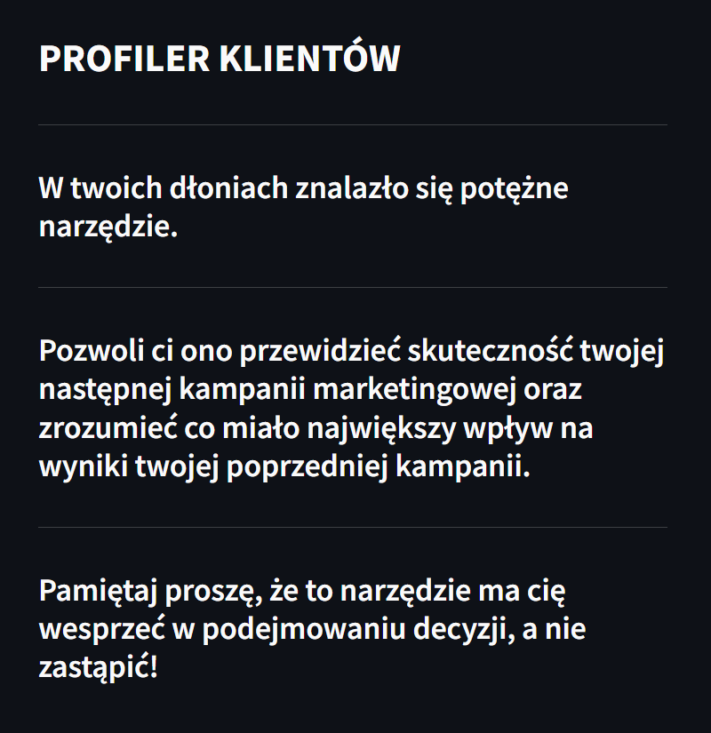
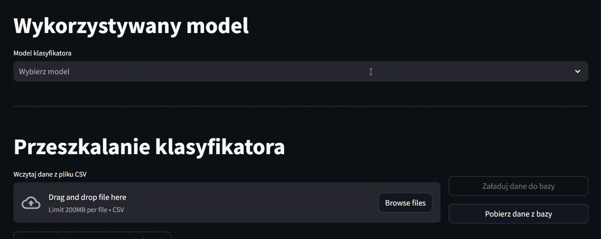
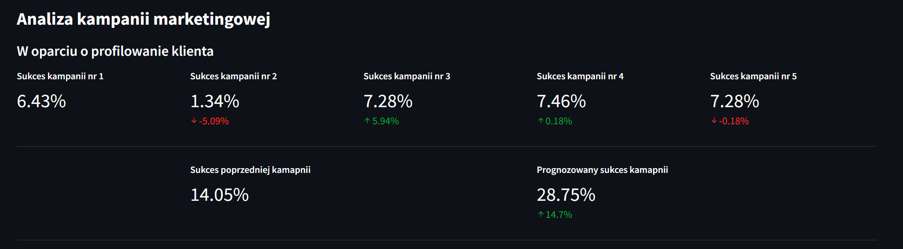
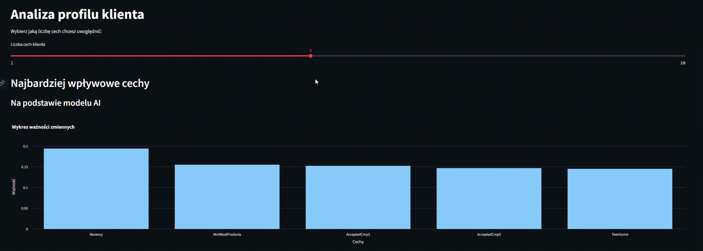
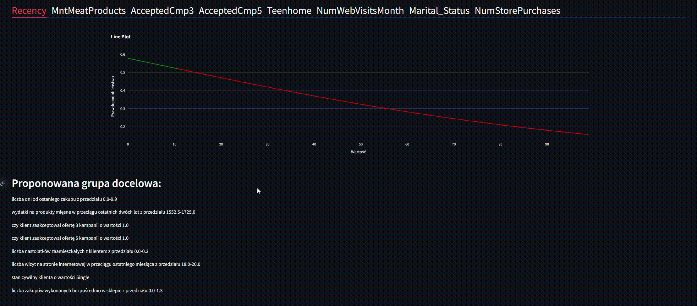

# Profilowanie Kampanii Marketingowej z Wykorzystaniem Uczenia Maszynowego i Metod XAI

## Opis projektu

Projekt polega na wykorzystaniu modeli uczenia maszynowego do profilowania kampanii marketingowej, a następnie interpretacji tych modeli przy użyciu metod XAI (Explainable Artificial Intelligence). Głównym celem jest zrozumienie, jakie cechy mają największy wpływ na skuteczność kampanii marketingowej.

W projekcie znajdują się:

- Skrypt do eksploracyjnej analizy danych (EDA) 
- Skrypty do preprocessingu oraz procesu uczenia modeli
- Skrypt do obsługi bazy danych
- Skrypt do budowania explainerów oraz przeprowadzenia XAI
- Zapisane modele w formacie `.pkl` będące wynikiem dostrajania 

## Dane

Dane wykorzystane w projekcie pochodzą z otwartego źródła na platformie Kaggle - [Marketing Campaign](https://www.kaggle.com/datasets/rodsaldanha/arketing-campaign).

Jest to rzeczywisty zbiór danych udostępniony przez brazylijską firmę `ifood`, która prowadzi platformę do zamawiania i dostarczania jedzenia online. Firma działa głównie w Brazylii i Kolumbii, posiadając ponad 80% udziału w rynku sektora dostaw żywności w Brazylii.

Zbiór danych został udostępniony w celu opracowania rozwiązania, które mogłoby zwiększyć efektywność marketingową firmy.

## Dokumentacja

Dokumentację poszczególnych etapów można znaleźć w następujących plikach:

- Eksploracyjna analiza danych - [EDA](EDA.md)
- Proces uczenia modeli - [ML](ML.md)

## Aplikacja/UI oraz funkcjonalność

Aplikacja webowa stanowi interfejs do interkacji ze zbudowanymi modelami uczenia maszynowego.
Zawiera ona następujące funkcjonalności:

- Import danych do bazy z pliku csv oraz doszkolenie modeli do nowych obserwacji
- Wybór klasyfikatora podstawie któego dokonywana będzie analiza kampanii
- Podsumowanie metryk wybranego klasyfikatora
- Podsumowanie frkacji sukcesu przeprowadzonych wcześniej kampanii
- Możliwość ręcznego sterowania ilością wpływowych cech
- Wgląd w cechy klienta mające największy wpływ na uzyskanie od niego pozytywnej odpowiedzi
- Wgląd w wykres przebiegu prawdopodobieństwa dla każdej istotnej cechy
- Intuicyjnie zaznaczone obszary na wykresie przedstawiające obszary największego zainteresowania
- Słowny opis zawierający informacje o grupie docelowej

### Prezentacja aplikacji

W sekcji poniżej znajdują się screeny z wyglądem oraz funkcjonalnością aplikacji.

#### Strona tytułowa/Wprowadzenie

#### Wybór modelu

#### Doszkalanie klasyfikatora

#### Podsumowanie kampanii

#### Wykres ważności cech

#### Analiza wykresów

## Plany rozwoju na przyszłość

- Tworzenie segmentacji obecnych klientów z wykorzystaniem cech uzyskanych z XAI.
- Integracja zewnętrznych danych, takich jak dane demograficzne czy zachowania online, w celu lepszego profilowania grup docelowych.
- Badanie wpływu kampanii marketingowych na różne segmenty klientów i dostosowywanie strategii marketingowej w oparciu o te wyniki.